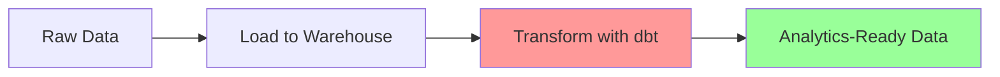

# dbt (data build tool)

#data-engineering #analytics #sql #transformation #data-warehouse

## Overview

**dbt** (data build tool) is an open-source command-line tool that enables data analysts and engineers to transform data in their warehouse more effectively using software engineering practices.

> [!quote] Core Philosophy "dbt enables data analysts and engineers to transform their data using the same practices that software engineers use to collaborate on code."

**Created by:** Fishtown Analytics (now dbt Labs)  
**First Release:** 2016  
**License:** Apache 2.0  
**Language:** Python with [[Jinja]] templating

## What dbt Does vs Doesn't Do

### ✅ What dbt Does

- **Transforms data** inside your data warehouse
- **Compiles SQL** into optimized queries
- **Manages dependencies** between transformations
- **Provides testing** framework for data quality
- **Generates documentation** automatically
- **Enables version control** for analytics code
- **Supports collaboration** through shared models

### ❌ What dbt Doesn't Do

- Extract or Load data (not an ETL tool)
- Orchestrate workflows (needs [[Airflow]], [[Dagster]], etc.)
- Serve data to end users (not a BI tool)
- Store data (works with existing [[Data Warehouse]])
- Handle streaming data (batch-focused)

---

## Core Concepts

#dbt/concepts

### ELT vs ETL Philosophy

mermaid



**Traditional ETL:** Extract → Transform → Load

**Modern ELT with dbt:** Extract → Load → Transform (in warehouse)

### The dbt Workflow

1. **Extract & Load**: Get raw data into warehouse
2. **Model**: Write SQL transformations as dbt models
3. **Test**: Add data quality tests
4. **Document**: Describe models and columns
5. **Deploy**: Version control and CI/CD

---

## Architecture & Components

#dbt/architecture

### Project Structure

```
my_dbt_project/
├── dbt_project.yml          # Project configuration
├── profiles.yml             # Connection settings
├── models/
│   ├── staging/            # Raw data cleaning
│   │   ├── _staging__sources.yml
│   │   └── stg_customers.sql
│   ├── intermediate/       # Business logic
│   │   └── int_customer_orders.sql
│   └── marts/             # Final business tables
│       ├── core/
│       │   └── dim_customers.sql
│       └── finance/
│           └── fct_orders.sql
├── tests/                  # Custom data tests
├── macros/                # Reusable SQL functions
├── seeds/                 # CSV reference data
├── snapshots/             # SCD Type 2 tables
├── analyses/              # Ad-hoc queries
└── docs/                  # Additional documentation
```

### Core Components Deep Dive

#### 1. Models

**Location:** `models/` directory  
**Purpose:** SQL files that define data transformations

sql

```sql
-- models/staging/stg_orders.sql
{{ config(materialized='view') }}

SELECT
    order_id,
    customer_id,
    order_date,
    status,
    {{ cents_to_dollars('amount_cents') }} as amount_dollars,
    created_at,
    updated_at
FROM {{ source('ecommerce', 'orders') }}
WHERE order_date >= '2020-01-01'
```

#### 2. Sources

**Location:** `models/schema.yml`  
**Purpose:** Define and test raw data inputs

yaml

```yaml
sources:
  - name: ecommerce
    database: raw_data
    schema: public
    description: "Raw e-commerce data from production database"
    tables:
      - name: orders
        description: "Customer order transactions"
        columns:
          - name: order_id
            description: "Unique identifier for each order"
            tests:
              - unique
              - not_null
          - name: customer_id
            description: "Reference to customer"
            tests:
              - not_null
          - name: amount_cents
            description: "Order amount in cents"
            tests:
              - not_null
              - positive_values
        freshness:
          warn_after: {count: 12, period: hour}
          error_after: {count: 24, period: hour}
```

#### 3. Seeds

**Location:** `seeds/` directory  
**Purpose:** CSV files for small reference data

csv

```csv
-- seeds/payment_methods.csv
payment_method_id,name,processing_fee
1,credit_card,0.029
2,debit_card,0.015
3,bank_transfer,0.005
4,digital_wallet,0.025
```

#### 4. Snapshots

**Location:** `snapshots/` directory  
**Purpose:** Capture slowly changing dimensions (SCD Type 2)

sql

```sql
-- snapshots/customers_snapshot.sql


{{
    config(
      target_database='analytics',
      target_schema='snapshots',
      unique_key='customer_id',
      strategy='timestamp',
      updated_at='updated_at',
    )
}}

SELECT * FROM {{ source('ecommerce', 'customers') }}


```

---

## Materializations

#dbt/materializations

|Type|Description|Build Time|Query Performance|Storage|Use Case|
|---|---|---|---|---|---|
|**View**|Virtual table|Fast|Slow|None|Light transformations|
|**Table**|Physical table|Slow|Fast|High|Heavy transformations|
|**Incremental**|Append/merge|Fast|Fast|Medium|Large, growing datasets|
|**Ephemeral**|CTE in dependent models|N/A|Varies|None|Intermediate logic|

### Materialization Examples

#### View (Default)

sql

```sql
{{ config(materialized='view') }}

SELECT 
    customer_id,
    first_name,
    last_name,
    email
FROM {{ ref('stg_customers') }}
WHERE status = 'active'
```

#### Table

sql

```sql
{{ config(materialized='table') }}

SELECT 
    customer_id,
    count(*) as total_orders,
    sum(order_amount) as total_spent,
    avg(order_amount) as avg_order_value,
    max(order_date) as last_order_date
FROM {{ ref('fct_orders') }}
GROUP BY customer_id
```

#### Incremental

sql

```sql
{{
  config(
    materialized='incremental',
    unique_key='order_id',
    on_schema_change='fail'
  )
}}

SELECT 
    order_id,
    customer_id,
    order_date,
    order_amount,
    updated_at
FROM {{ ref('stg_orders') }}


  WHERE updated_at > (SELECT max(updated_at) FROM {{ this }})

```

#### Ephemeral

sql

```sql
{{ config(materialized='ephemeral') }}

SELECT 
    customer_id,
    sum(order_amount) as total_spent
FROM {{ ref('stg_orders') }}
GROUP BY customer_id
```

---

## Jinja Templating & Macros

#dbt/jinja #dbt/macros

### Built-in Functions

|Function|Purpose|Example|
|---|---|---|
|`{{ ref() }}`|Reference other models|`{{ ref('customers') }}`|
|`{{ source() }}`|Reference source tables|`{{ source('raw', 'orders') }}`|
|`{{ var() }}`|Use variables|`{{ var('start_date') }}`|
|`{{ this }}`|Current model reference|Used in incremental models|
|`{{ target }}`|Target information|`{{ target.name }}`, `{{ target.schema }}`|

### Jinja Control Structures

#### Conditional Logic

sql

```sql
SELECT 
    customer_id,
    first_name,
    last_name,
    
        email,
        phone
    
        'hidden@example.com' as email,
        'XXX-XXX-XXXX' as phone
    
FROM {{ ref('stg_customers') }}
```

#### Loops

sql

```sql
SELECT 
    order_id,
    
    sum(case when payment_method = '{{ payment_method }}' then amount else 0 end) as {{ payment_method }}_amount
    ,
    
FROM {{ ref('stg_orders') }}
GROUP BY order_id
```

### Custom Macros

#### Simple Macro

sql

```sql
-- macros/cents_to_dollars.sql

    round({{ column_name }} / 100.0, {{ scale }})


-- Usage in models
SELECT 
    order_id,
    {{ cents_to_dollars('amount_cents') }} as amount_dollars
FROM {{ source('ecommerce', 'orders') }}
```

#### Advanced Macro with Documentation

sql

```sql
-- macros/generate_alias_name.sql

    
    
        {{ default_schema }}
    
        {{ default_schema }}_{{ custom_schema_name | trim }}
    

```

#### Macro for Data Quality

sql

```sql
-- macros/test_not_empty_string.sql

    SELECT {{ column_name }}
    FROM {{ model }}
    WHERE {{ column_name }} is null 
       OR trim({{ column_name }}) = ''

```

---

## Testing Framework

#dbt/testing #data-quality

### Built-in Generic Tests

#### Schema Tests

yaml

```yaml
# models/schema.yml
models:
  - name: dim_customers
    description: "Customer dimension table"
    columns:
      - name: customer_id
        description: "Primary key for customers"
        tests:
          - unique
          - not_null
      - name: email
        description: "Customer email address"
        tests:
          - unique
          - not_null
      - name: status
        description: "Customer account status"
        tests:
          - accepted_values:
              values: ['active', 'inactive', 'suspended', 'closed']
      - name: created_at
        description: "Account creation timestamp"
        tests:
          - not_null
```

### Custom Singular Tests

sql

```sql
-- tests/assert_positive_order_amounts.sql
SELECT *
FROM {{ ref('fct_orders') }}
WHERE order_amount <= 0
```

sql

```sql
-- tests/assert_customer_order_consistency.sql
WITH customer_orders AS (
    SELECT 
        c.customer_id,
        c.total_orders as dim_total_orders,
        count(o.order_id) as fact_total_orders
    FROM {{ ref('dim_customers') }} c
    LEFT JOIN {{ ref('fct_orders') }} o 
        ON c.customer_id = o.customer_id
    GROUP BY 1, 2
)

SELECT *
FROM customer_orders
WHERE dim_total_orders != fact_total_orders
```

### Custom Generic Tests

sql

```sql
-- macros/test_referential_integrity.sql

    
    WITH child AS (
        SELECT {{ column_name }} as id
        FROM {{ model }}
    ),
    parent AS (
        SELECT {{ field }} as id  
        FROM {{ to }}
    )
    
    SELECT child.id
    FROM child
    LEFT JOIN parent ON child.id = parent.id
    WHERE parent.id is null



-- Usage in schema.yml
models:
  - name: fct_orders
    columns:
      - name: customer_id
        tests:
          - referential_integrity:
              to: ref('dim_customers')
              field: customer_id
```

### Test Configuration

yaml

```yaml
# dbt_project.yml
tests:
  my_project:
    +severity: warn  # Don't fail on test failures, just warn
    staging:
      +severity: error  # Critical tests should fail

# Test-specific configuration
models:
  - name: fct_orders
    tests:
      - relationships:
          to: ref('dim_customers')
          field: customer_id
          config:
            severity: error
            error_if: ">100"  # Fail if more than 100 referential integrity issues
            warn_if: ">10"    # Warn if more than 10 issues
```

---

## Configuration Management

#dbt/configuration

### dbt_project.yml

yaml

```yaml
name: 'ecommerce_analytics'
version: '1.0.0'
config-version: 2

# This setting configures which "profile" dbt uses for this project.
profile: 'ecommerce_analytics'

# These configurations specify where dbt should look for different types of files.
model-paths: ["models"]
analysis-paths: ["analyses"]
test-paths: ["tests"]
seed-paths: ["seeds"]
macro-paths: ["macros"]
snapshot-paths: ["snapshots"]

target-path: "target"
clean-targets:
  - "target"
  - "dbt_packages"

# Model configurations
models:
  ecommerce_analytics:
    # Global configurations
    +materialized: view
    +on_schema_change: "fail"
    
    # Staging models
    staging:
      +materialized: view
      +docs:
        node_color: "lightblue"
    
    # Intermediate models  
    intermediate:
      +materialized: ephemeral
      +docs:
        node_color: "yellow"
    
    # Marts models
    marts:
      +materialized: table
      +docs:
        node_color: "green"
      
      # Core business entities
      core:
        +materialized: table
        +post-hook: "grant select on {{ this }} to role reporter"
      
      # Finance specific
      finance:
        +materialized: table
        +pre-hook: "{{ log('Building finance model: ' ~ this.name, info=true) }}"

# Snapshot configurations
snapshots:
  ecommerce_analytics:
    +target_schema: snapshots
    +strategy: timestamp
    +updated_at: updated_at

# Seed configurations  
seeds:
  ecommerce_analytics:
    +quote_columns: false
    +column_types:
      zipcode: varchar(5)

# Variables
vars:
  # Date variables
  start_date: '2020-01-01'
  end_date: '2024-12-31'
  
  # Feature flags
  enable_advanced_analytics: true
  include_pii: false
  
  # Business logic
  customer_segments:
    - 'bronze'
    - 'silver' 
    - 'gold'
    - 'platinum'

# Hooks
on-run-start:
  - "create schema if not exists {{ target.schema }}_staging"
  - "{{ log('Starting dbt run for target: ' ~ target.name, info=true) }}"

on-run-end:
  - "{{ log('dbt run completed for target: ' ~ target.name, info=true) }}"
  - "grant usage on schema {{ target.schema }} to role reporter"
```

### profiles.yml

yaml

```yaml
ecommerce_analytics:
  target: dev
  outputs:
    dev:
      type: postgres
      host: localhost
      user: "{{ env_var('DBT_USER') }}"
      password: "{{ env_var('DBT_PASSWORD') }}"
      port: 5432
      dbname: ecommerce_dev
      schema: "dbt_{{ env_var('USER') | replace('-', '_') }}"
      threads: 4
      keepalives_idle: 0
      connect_timeout: 10
      search_path: public
      
    staging:
      type: postgres  
      host: staging-db.company.com
      user: dbt_staging
      password: "{{ env_var('DBT_STAGING_PASSWORD') }}"
      port: 5432
      dbname: ecommerce_staging
      schema: analytics_staging
      threads: 8
      
    prod:
      type: snowflake
      account: "{{ env_var('SNOWFLAKE_ACCOUNT') }}"
      user: "{{ env_var('SNOWFLAKE_USER') }}"
      password: "{{ env_var('SNOWFLAKE_PASSWORD') }}"
      role: DBT_PROD_ROLE
      database: ECOMMERCE_PROD
      warehouse: DBT_WAREHOUSE
      schema: ANALYTICS
      threads: 12
      client_session_keep_alive: true
```

---

## Commands Reference

#dbt/commands

### Essential Commands

bash

```bash
# Project initialization
dbt init my_project

# Install packages
dbt deps

# Compile models (check syntax)
dbt compile
dbt compile --select customers

# Run models
dbt run
dbt run --select customers                    # Single model
dbt run --select +customers                   # Model and upstream dependencies  
dbt run --select customers+                   # Model and downstream dependencies
dbt run --select +customers+                  # Model and all dependencies
dbt run --select @customers                   # Model, parents, and children

# Test data quality
dbt test
dbt test --select customers
dbt test --select source:ecommerce

# Generate and serve documentation
dbt docs generate
dbt docs serve --port 8001

# Debug connection issues
dbt debug

# Seed reference data
dbt seed
dbt seed --select payment_methods

# Create snapshots
dbt snapshot
```

### Advanced Command Patterns

bash

```bash
# Modified selection (requires state comparison)
dbt run --select state:modified+
dbt test --select state:modified

# Exclude patterns
dbt run --exclude staging
dbt run --exclude tag:deprecated

# Tag-based selection  
dbt run --select tag:daily
dbt test --select tag:critical

# Resource type selection
dbt run --select resource_type:model
dbt test --select resource_type:test

# Full refresh incremental models
dbt run --full-refresh
dbt run --full-refresh --select +fct_orders

# Parsing and compilation
dbt parse                                     # Parse project files
dbt compile --select customers                # Compile specific model
dbt show --select customers --limit 5         # Preview model results

# Source operations
dbt source freshness                          # Check source freshness
dbt source freshness --select source:ecommerce.orders

# Retry failed models
dbt retry

# Clean generated files
dbt clean
```

### Command Options & Flags

bash

```bash
# Output options
dbt run --quiet                               # Minimal output
dbt run --debug                               # Debug output
dbt run --log-level info                      # Set log level

# Parallel execution
dbt run --threads 8                           # Override thread count

# Target environment
dbt run --target prod                         # Use specific target
dbt run --profiles-dir ~/.dbt                # Custom profiles location

# Variables
dbt run --vars '{"start_date": "2023-01-01"}' # Override variables
dbt run --vars start_date:2023-01-01          # Alternative syntax

# Fail fast
dbt run --fail-fast                           # Stop on first failure
dbt test --fail-fast                          # Stop on first test failure
```

---

## Layered Architecture Patterns

#dbt/architecture #dbt/best-practices

### The Medallion Architecture (Bronze-Silver-Gold)

```
Raw Data (Bronze) → Cleaned Data (Silver) → Business Logic (Gold)
     ↓                    ↓                        ↓
   staging/           intermediate/             marts/
```

#### Staging Layer (Bronze)

**Purpose:** One-to-one with source tables, light cleaning **Materialization:** Views **Naming:** `stg_<source>__<table>`

sql

```sql
-- models/staging/ecommerce/stg_ecommerce__orders.sql
{{ config(materialized='view') }}

WITH source AS (
    SELECT * FROM {{ source('ecommerce', 'orders') }}
),

renamed AS (
    SELECT
        -- IDs
        order_id,
        customer_id,
        
        -- Dates
        order_date::date as order_date,
        created_at::timestamp as created_at,
        updated_at::timestamp as updated_at,
        
        -- Amounts  
        amount_cents / 100.0 as order_amount,
        tax_cents / 100.0 as tax_amount,
        
        -- Strings
        lower(trim(status)) as order_status,
        lower(trim(payment_method)) as payment_method,
        
        -- Booleans
        case when is_deleted = 'true' then true else false end as is_deleted

    FROM source
    WHERE order_date >= '2020-01-01'  -- Data quality filter
)

SELECT * FROM renamed
```

#### Intermediate Layer (Silver)

**Purpose:** Complex business logic, many-to-one transformations **Materialization:** Ephemeral or Views **Naming:** `int_<entity>__<description>`

sql

```sql
-- models/intermediate/int_customers__order_summary.sql
{{ config(materialized='ephemeral') }}

SELECT
    customer_id,
    
    -- Order metrics
    count(*) as total_orders,
    count(distinct order_date) as active_days,
    sum(order_amount) as total_spent,
    avg(order_amount) as avg_order_value,
    
    -- Temporal metrics
    min(order_date) as first_order_date,
    max(order_date) as last_order_date,
    max(order_date) - min(order_date) as customer_lifespan_days,
    
    -- Derived metrics
    sum(order_amount) / nullif(count(distinct order_date), 0) as avg_daily_spend,
    
    -- Behavioral flags
    max(case when order_amount > 1000 then 1 else 0 end) as has_large_order,
    count(distinct payment_method) as payment_methods_used

FROM {{ ref('stg_ecommerce__orders') }}
WHERE order_status not in ('cancelled', 'failed')
GROUP BY customer_id
```

#### Marts Layer (Gold)

**Purpose:** Business-ready tables optimized for consumption  
**Materialization:** Tables **Naming:** `dim_<entity>` or `fct_<process>`

sql

```sql
-- models/marts/core/dim_customers.sql
{{ config(materialized='table') }}

WITH customers AS (
    SELECT * FROM {{ ref('stg_ecommerce__customers') }}
),

customer_orders AS (
    SELECT * FROM {{ ref('int_customers__order_summary') }}
),

customer_segments AS (
    SELECT 
        customer_id,
        case 
            when total_spent >= 10000 then 'platinum'
            when total_spent >= 5000 then 'gold'  
            when total_spent >= 1000 then 'silver'
            else 'bronze'
        end as customer_segment,
        
        case
            when last_order_date >= current_date - interval '30 days' then 'active'
            when last_order_date >= current_date - interval '90 days' then 'at_risk'
            when last_order_date >= current_date - interval '365 days' then 'dormant'
            else 'lost'
        end as lifecycle_stage
        
    FROM customer_orders
)

SELECT
    -- Primary key
    c.customer_id,
    
    -- Customer attributes
    c.first_name,
    c.last_name,
    c.first_name || ' ' || c.last_name as full_name,
    c.email,
    c.phone,
    c.date_of_birth,
    c.registration_date,
    
    -- Geographic  
    c.city,
    c.state,
    c.country,
    c.postal_code,
    
    -- Order summary metrics
    coalesce(co.total_orders, 0) as total_orders,
    coalesce(co.total_spent, 0) as total_spent,
    co.avg_order_value,
    co.first_order_date,
    co.last_order_date,
    co.customer_lifespan_days,
    
    -- Segmentation
    coalesce(cs.customer_segment, 'bronze') as customer_segment,
    coalesce(cs.lifecycle_stage, 'prospect') as lifecycle_stage,
    
    -- Behavioral flags
    coalesce(co.has_large_order = 1, false) as has_large_order,
    co.payment_methods_used > 1 as uses_multiple_payment_methods,
    
    -- Audit fields
    c.created_at as customer_created_at,
    c.updated_at as customer_updated_at,
    current_timestamp as dbt_updated_at

FROM customers c
LEFT JOIN customer_orders co ON c.customer_id = co.customer_id  
LEFT JOIN customer_segments cs ON c.customer_id = cs.customer_id
WHERE c.is_deleted = false
```

---

## Data Quality & Testing Strategy

#dbt/data-quality #dbt/testing-strategy

### Testing Pyramid

```
    Unit Tests (Model-level)
         ↑
    Integration Tests (Cross-model)
         ↑
    Data Quality Tests (Business Rules)
         ↑
    Freshness Tests (Source SLA)
```

### Comprehensive Testing Examples

#### Source Data Quality

yaml

```yaml
# models/staging/_sources.yml
sources:
  - name: ecommerce
    tables:
      - name: orders
        tests:
          - dbt_utils.expression_is_true:
              expression: "order_date <= current_date"
              config:
                severity: error
        columns:
          - name: order_id
            tests:
              - unique:
                  config:
                    severity: error
              - not_null:
                  config:
                    severity: error
          - name: order_amount
            tests:
              - not_null
              - dbt_utils.accepted_range:
                  min_value: 0
                  max_value: 1000000
                  config:
                    severity: warn
```

#### Model-Level Testing

yaml

```yaml
# models/marts/schema.yml
models:
  - name: dim_customers
    tests:
      - dbt_utils.equal_rowcount:
          compare_model: ref('stg_ecommerce__customers')
          config:
            severity: error
      - dbt_utils.expression_is_true:
          expression: "total_spent >= 0"
          config:
            severity: error
            
    columns:
      - name: customer_id
        tests:
          - unique:
              config:
                severity: error
          - not_null:
              config:
                severity: error
                
      - name: customer_segment
        tests:
          - accepted_values:
              values: ['bronze', 'silver', 'gold', 'platinum']
              config:
                severity: error
                
      - name: email
        tests:
          - unique:
              config:
                severity: warn
                warn_if: ">5"
          - dbt_utils.not_empty_string:
              config:
                severity: error
```

#### Custom Business Logic Tests

sql

```sql
-- tests/assert_customer_order_totals_match.sql
-- Test that customer order totals in dim_customers match fct_orders
WITH customer_totals AS (
    SELECT 
        customer_id,
        sum(order_amount) as calculated_total
    FROM {{ ref('fct_orders') }}
    GROUP BY customer_id
),

dimension_totals AS (
    SELECT 
        customer_id,
        total_spent as dimension_total
    FROM {{ ref('dim_customers') }}
    WHERE total_orders > 0
)

SELECT 
    ct.customer_id,
    ct.calculated_total,
    dt.dimension_total,
    abs(ct.calculated_total - dt.dimension_total) as difference
FROM customer_totals ct
FULL OUTER JOIN dimension_totals dt 
    ON ct.customer_id = dt.customer_id
WHERE abs(coalesce(ct.calculated_total, 0) - coalesce(dt.dimension_total, 0)) > 0.01
```

### Advanced Testing with dbt-expectations

yaml

```yaml
# Install: dbt deps after adding to packages.yml
models:
  - name: fct_orders
    tests:
      - dbt_expectations.expect_table_row_count_to_be_between:
          min_value: 1000
          max_value: 1000000
      - dbt_expectations.expect_table_columns_to_match_ordered_list:
          column_list: ["order_id", "customer_id", "order_date", "order_amount"]
          
    columns:
      - name: order_amount
        tests:
          - dbt_expectations.expect_column_values_to_be_between:
              min_value: 0
              max_value: 100000
              mostly: 0.95  # 95% of values should be in range
          - dbt_expectations.expect_column_mean_to_be_between:
              min_value: 50
              max_value: 500
```

---

## Documentation & Lineage

#dbt/documentation

### Model Documentation

yaml

```yaml
# models/schema.yml
models:
  - name: dim_customers
    description: |
      Customer dimension table containing current customer information and 
      calculated metrics. This table is updated daily and includes customer
      segmentation based on spending behavior.
      
      ## Business Logic
      - Customer segments are calculated based on total lifetime spend
      - Lifecycle stages use last order date to determine engagement level
      - Only active (non-deleted) customers are included
      
      ## Update Schedule
      - Refreshed daily at 6 AM UTC
      - Source data from production database via Fivetran
      
    columns:
      - name: customer_id
        description: "Unique identifier for each customer. Primary key."
        tests:
          - unique
          - not_null
          
      - name: customer_segment  
        description: |
          Customer spending tier classification:
          - Bronze: < $1,000 lifetime spend
          - Silver: $1,000 - $4,999 lifetime spend  
          - Gold: $5,000 - $9,999 lifetime spend
          - Platinum: $10,000+ lifetime spend
        tests:
          - accepted_values:
              values: ['bronze', 'silver', 'gold', 'platinum']
              
      - name: lifecycle_stage
        description: |
          Customer engagement classification based on recency:
          - Active: Ordered within last 30 days
          - At Risk: Ordered within last 90 days  
          - Dormant: Ordered within last 365 days
          - Lost: No orders in last 365 days
          - Prospect: Registered but never ordered
```

### Auto-Generated Documentation Features

