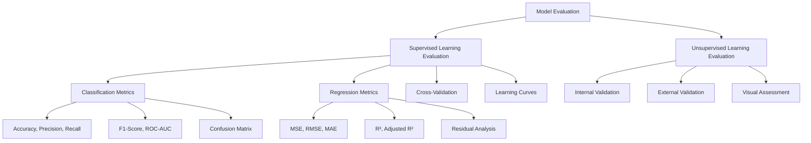
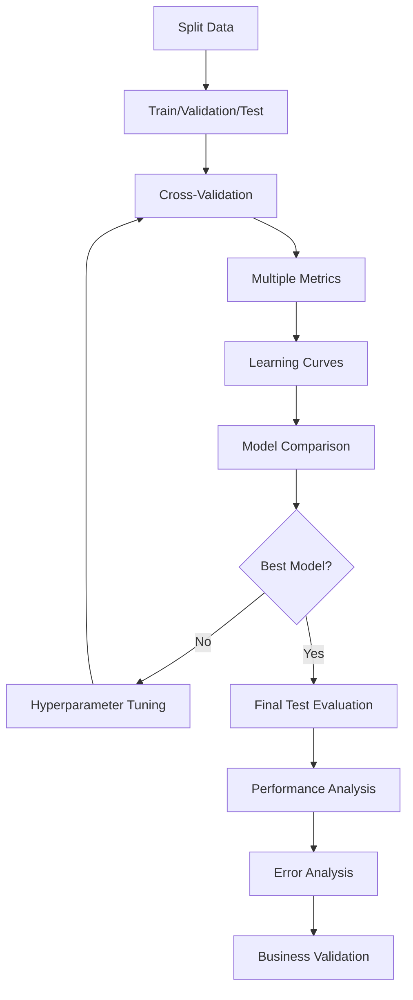

# Model Evaluation

## Overview

**Model Evaluation** is the process of assessing how well a machine learning model performs on data it hasn't seen during training. It's crucial for understanding model quality, comparing different models, and ensuring reliable performance in production.

> [!note] Key Insight Model evaluation is like taking an exam after studying - it tests whether your model truly learned generalizable patterns or just memorized the training data.

## Definition & Core Concepts

Model evaluation involves:

- **Performance Assessment**: Measuring how well a model performs its intended task
- **Generalization Testing**: Ensuring the model works on new, unseen data
- **Model Comparison**: Choosing between different algorithms or configurations
- **Reliability Validation**: Confirming consistent performance across different scenarios

### Fundamental Principles

#### Train-Validation-Test Split

- **Training Set (60-70%)**: Used to train the model
- **Validation Set (15-20%)**: Used for hyperparameter tuning and model selection
- **Test Set (15-20%)**: Used for final, unbiased performance evaluation

#### [[Cross-Validation]]

- Systematic approach to evaluate model performance
- Reduces variance in performance estimates
- Provides more robust assessment than single train-test split

## Types of Model Evaluation



## Classification Metrics

### Basic Metrics

#### Confusion Matrix

```python
from sklearn.metrics import confusion_matrix, ConfusionMatrixDisplay
import matplotlib.pyplot as plt

# Create confusion matrix
cm = confusion_matrix(y_true, y_pred)
disp = ConfusionMatrixDisplay(confusion_matrix=cm, display_labels=class_names)
disp.plot(cmap='Blues')
plt.title('Confusion Matrix')
plt.show()

# Manual calculation from confusion matrix
tn, fp, fn, tp = cm.ravel()  # for binary classification
print(f"True Negatives: {tn}")
print(f"False Positives: {fp}")
print(f"False Negatives: {fn}")
print(f"True Positives: {tp}")
```

### Core Classification Metrics

|Metric|Formula|Interpretation|Use Case|
|---|---|---|---|
|**Accuracy**|`(TP + TN) / (TP + TN + FP + FN)`|Overall correctness|Balanced datasets|
|**Precision**|`TP / (TP + FP)`|Positive prediction accuracy|Cost of false positives high|
|**Recall (Sensitivity)**|`TP / (TP + FN)`|True positive detection rate|Cost of false negatives high|
|**Specificity**|`TN / (TN + FP)`|True negative detection rate|Medical screening|
|**F1-Score**|`2 × (Precision × Recall) / (Precision + Recall)`|Harmonic mean of precision/recall|Imbalanced datasets|

```python
from sklearn.metrics import (accuracy_score, precision_score, recall_score, 
                           f1_score, classification_report)

# Calculate basic metrics
accuracy = accuracy_score(y_true, y_pred)
precision = precision_score(y_true, y_pred, average='weighted')
recall = recall_score(y_true, y_pred, average='weighted')
f1 = f1_score(y_true, y_pred, average='weighted')

print(f"Accuracy: {accuracy:.3f}")
print(f"Precision: {precision:.3f}")
print(f"Recall: {recall:.3f}")
print(f"F1-Score: {f1:.3f}")

# Comprehensive classification report
report = classification_report(y_true, y_pred, target_names=class_names)
print("\nClassification Report:")
print(report)
```

### Advanced Classification Metrics

#### ROC Curve and AUC

```python
from sklearn.metrics import roc_curve, auc, roc_auc_score
import matplotlib.pyplot as plt

# For binary classification
fpr, tpr, thresholds = roc_curve(y_true, y_pred_proba)
roc_auc = auc(fpr, tpr)

# Plot ROC curve
plt.figure(figsize=(8, 6))
plt.plot(fpr, tpr, color='darkorange', lw=2, 
         label=f'ROC Curve (AUC = {roc_auc:.2f})')
plt.plot([0, 1], [0, 1], color='navy', lw=2, linestyle='--', 
         label='Random Classifier')
plt.xlim([0.0, 1.0])
plt.ylim([0.0, 1.05])
plt.xlabel('False Positive Rate')
plt.ylabel('True Positive Rate')
plt.title('Receiver Operating Characteristic (ROC) Curve')
plt.legend(loc="lower right")
plt.grid(True)
plt.show()

# AUC score directly
auc_score = roc_auc_score(y_true, y_pred_proba)
print(f"AUC Score: {auc_score:.3f}")
```

#### Precision-Recall Curve

```python
from sklearn.metrics import precision_recall_curve, average_precision_score

# Calculate precision-recall curve
precision_vals, recall_vals, thresholds = precision_recall_curve(y_true, y_pred_proba)
avg_precision = average_precision_score(y_true, y_pred_proba)

# Plot PR curve
plt.figure(figsize=(8, 6))
plt.plot(recall_vals, precision_vals, color='blue', lw=2,
         label=f'PR Curve (AP = {avg_precision:.2f})')
plt.xlabel('Recall')
plt.ylabel('Precision')
plt.title('Precision-Recall Curve')
plt.legend(loc="lower left")
plt.grid(True)
plt.show()
```

#### Multi-class Metrics

```python
from sklearn.metrics import cohen_kappa_score, matthews_corrcoef

# Cohen's Kappa (agreement measure)
kappa = cohen_kappa_score(y_true, y_pred)
print(f"Cohen's Kappa: {kappa:.3f}")

# Matthews Correlation Coefficient (for binary/multiclass)
mcc = matthews_corrcoef(y_true, y_pred)
print(f"Matthews Correlation Coefficient: {mcc:.3f}")

# Macro and Micro averages
precision_macro = precision_score(y_true, y_pred, average='macro')
precision_micro = precision_score(y_true, y_pred, average='micro')
print(f"Precision (Macro): {precision_macro:.3f}")
print(f"Precision (Micro): {precision_micro:.3f}")
```

### Handling Imbalanced Data

> [!warning] Imbalanced Dataset Issues Accuracy can be misleading with imbalanced classes. A model predicting the majority class 95% of the time achieves 95% accuracy on a 95-5% split, but provides no value.

```python
from sklearn.metrics import balanced_accuracy_score
from collections import Counter

# Check class distribution
class_counts = Counter(y_true)
print(f"Class distribution: {class_counts}")

# Balanced accuracy (accounts for class imbalance)
balanced_acc = balanced_accuracy_score(y_true, y_pred)
print(f"Balanced Accuracy: {balanced_acc:.3f}")

# Class-specific metrics
report_dict = classification_report(y_true, y_pred, output_dict=True)
for class_name, metrics in report_dict.items():
    if class_name.isdigit() or class_name in ['0', '1']:
        print(f"Class {class_name}: Precision={metrics['precision']:.3f}, "
              f"Recall={metrics['recall']:.3f}, F1={metrics['f1-score']:.3f}")
```

## Regression Metrics

### Basic Regression Metrics

|Metric|Formula|Interpretation|Use Case|
|---|---|---|---|
|**MAE**|`Σ|y_true - y_pred|/ n`|
|**MSE**|`Σ(y_true - y_pred)² / n`|Mean squared error|Penalizes large errors|
|**RMSE**|`√MSE`|Root mean squared error|Same units as target|
|**R²**|`1 - SS_res/SS_tot`|Coefficient of determination|Explained variance|
|**Adjusted R²**|`1 - (1-R²)(n-1)/(n-p-1)`|R² adjusted for features|Prevents overfitting|

```python
from sklearn.metrics import (mean_absolute_error, mean_squared_error, 
                           r2_score, explained_variance_score)
import numpy as np

# Calculate regression metrics
mae = mean_absolute_error(y_true, y_pred)
mse = mean_squared_error(y_true, y_pred)
rmse = np.sqrt(mse)
r2 = r2_score(y_true, y_pred)

print(f"Mean Absolute Error (MAE): {mae:.3f}")
print(f"Mean Squared Error (MSE): {mse:.3f}")
print(f"Root Mean Squared Error (RMSE): {rmse:.3f}")
print(f"R² Score: {r2:.3f}")

# Adjusted R²
def adjusted_r2(r2, n_samples, n_features):
    return 1 - (1 - r2) * (n_samples - 1) / (n_samples - n_features - 1)

adj_r2 = adjusted_r2(r2, len(y_true), X.shape[1])
print(f"Adjusted R²: {adj_r2:.3f}")
```

### Advanced Regression Metrics

```python
from sklearn.metrics import mean_absolute_percentage_error, median_absolute_error

# Mean Absolute Percentage Error
mape = mean_absolute_percentage_error(y_true, y_pred)
print(f"Mean Absolute Percentage Error (MAPE): {mape:.3f}")

# Median Absolute Error (robust to outliers)
medae = median_absolute_error(y_true, y_pred)
print(f"Median Absolute Error: {medae:.3f}")

# Custom metrics
def mean_absolute_scaled_error(y_true, y_pred, y_train):
    """Mean Absolute Scaled Error"""
    mae = mean_absolute_error(y_true, y_pred)
    naive_mae = mean_absolute_error(y_train[1:], y_train[:-1])  # naive forecast
    return mae / naive_mae

# Symmetric Mean Absolute Percentage Error
def smape(y_true, y_pred):
    return 100 * np.mean(2 * np.abs(y_pred - y_true) / (np.abs(y_true) + np.abs(y_pred)))
```

### Residual Analysis

```python
import matplotlib.pyplot as plt
import seaborn as sns
from scipy import stats

# Calculate residuals
residuals = y_true - y_pred

# Residual plots
fig, axes = plt.subplots(2, 2, figsize=(12, 10))

# 1. Residuals vs Fitted values
axes[0,0].scatter(y_pred, residuals, alpha=0.6)
axes[0,0].axhline(y=0, color='red', linestyle='--')
axes[0,0].set_xlabel('Fitted Values')
axes[0,0].set_ylabel('Residuals')
axes[0,0].set_title('Residuals vs Fitted')

# 2. Q-Q plot for normality
stats.probplot(residuals, dist="norm", plot=axes[0,1])
axes[0,1].set_title('Normal Q-Q Plot')

# 3. Histogram of residuals
axes[1,0].hist(residuals, bins=30, edgecolor='black', alpha=0.7)
axes[1,0].set_xlabel('Residuals')
axes[1,0].set_ylabel('Frequency')
axes[1,0].set_title('Distribution of Residuals')

# 4. Residuals vs Order
axes[1,1].plot(range(len(residuals)), residuals, 'o-', alpha=0.6)
axes[1,1].axhline(y=0, color='red', linestyle='--')
axes[1,1].set_xlabel('Observation Order')
axes[1,1].set_ylabel('Residuals')
axes[1,1].set_title('Residuals vs Order')

plt.tight_layout()
plt.show()

# Statistical tests
from scipy.stats import shapiro, jarque_bera

# Test for normality
shapiro_stat, shapiro_p = shapiro(residuals)
jb_stat, jb_p = jarque_bera(residuals)

print(f"Shapiro-Wilk Test: statistic={shapiro_stat:.4f}, p-value={shapiro_p:.4f}")
print(f"Jarque-Bera Test: statistic={jb_stat:.4f}, p-value={jb_p:.4f}")
```

## Cross-Validation Techniques

### K-Fold Cross-Validation

```python
from sklearn.model_selection import (cross_val_score, cross_validate, 
                                   KFold, StratifiedKFold, TimeSeriesSplit)
from sklearn.ensemble import RandomForestClassifier
import numpy as np

# Basic k-fold cross-validation
model = RandomForestClassifier(n_estimators=100, random_state=42)

# Simple cross-validation
cv_scores = cross_val_score(model, X, y, cv=5, scoring='accuracy')
print(f"Cross-validation scores: {cv_scores}")
print(f"Mean CV Score: {cv_scores.mean():.3f} (+/- {cv_scores.std() * 2:.3f})")

# More detailed cross-validation
scoring = ['accuracy', 'precision_weighted', 'recall_weighted', 'f1_weighted']
cv_results = cross_validate(model, X, y, cv=5, scoring=scoring, 
                           return_train_score=True)

for metric in scoring:
    train_scores = cv_results[f'train_{metric}']
    test_scores = cv_results[f'test_{metric}']
    print(f"{metric.capitalize()}:")
    print(f"  Train: {train_scores.mean():.3f} (+/- {train_scores.std() * 2:.3f})")
    print(f"  Test:  {test_scores.mean():.3f} (+/- {test_scores.std() * 2:.3f})")
```

### Specialized Cross-Validation

#### Stratified K-Fold (for Classification)

```python
# Ensures each fold has representative class distribution
skf = StratifiedKFold(n_splits=5, shuffle=True, random_state=42)
cv_scores = cross_val_score(model, X, y, cv=skf, scoring='f1_weighted')
print(f"Stratified CV Scores: {cv_scores.mean():.3f} (+/- {cv_scores.std() * 2:.3f})")
```

#### Time Series Cross-Validation

```python
# For time series data - respects temporal order
tscv = TimeSeriesSplit(n_splits=5)
cv_scores = cross_val_score(model, X, y, cv=tscv, scoring='neg_mean_squared_error')
print(f"Time Series CV Scores: {-cv_scores.mean():.3f} (+/- {cv_scores.std() * 2:.3f})")
```

#### Leave-One-Out Cross-Validation

```python
from sklearn.model_selection import LeaveOneOut

# For small datasets
loo = LeaveOneOut()
cv_scores = cross_val_score(model, X, y, cv=loo, scoring='accuracy')
print(f"LOO CV Score: {cv_scores.mean():.3f}")
```

### Custom Cross-Validation

```python
from sklearn.model_selection import cross_val_predict
import matplotlib.pyplot as plt

# Get cross-validated predictions
y_pred_cv = cross_val_predict(model, X, y, cv=5)

# Calculate metrics on cross-validated predictions
cv_accuracy = accuracy_score(y, y_pred_cv)
cv_f1 = f1_score(y, y_pred_cv, average='weighted')

print(f"Cross-validated Accuracy: {cv_accuracy:.3f}")
print(f"Cross-validated F1-Score: {cv_f1:.3f}")

# Plot cross-validated predictions vs true values (for regression)
# plt.scatter(y, y_pred_cv, alpha=0.6)
# plt.plot([y.min(), y.max()], [y.min(), y.max()], 'r--', lw=2)
# plt.xlabel('True Values')
# plt.ylabel('Cross-validated Predictions')
# plt.title('Cross-validated Predictions vs True Values')
```

## Learning Curves & Validation Curves

### Learning Curves

```python
from sklearn.model_selection import learning_curve
import matplotlib.pyplot as plt

def plot_learning_curve(estimator, X, y, cv=5, title="Learning Curve"):
    """Plot learning curve to diagnose bias/variance"""
    
    train_sizes, train_scores, val_scores = learning_curve(
        estimator, X, y, cv=cv, 
        train_sizes=np.linspace(0.1, 1.0, 10),
        scoring='accuracy', n_jobs=-1
    )
    
    # Calculate means and standard deviations
    train_mean = train_scores.mean(axis=1)
    train_std = train_scores.std(axis=1)
    val_mean = val_scores.mean(axis=1)
    val_std = val_scores.std(axis=1)
    
    # Plot learning curve
    plt.figure(figsize=(10, 6))
    plt.plot(train_sizes, train_mean, 'o-', color='blue', label='Training Score')
    plt.fill_between(train_sizes, train_mean - train_std, train_mean + train_std, 
                     alpha=0.1, color='blue')
    
    plt.plot(train_sizes, val_mean, 'o-', color='red', label='Cross-validation Score')
    plt.fill_between(train_sizes, val_mean - val_std, val_mean + val_std, 
                     alpha=0.1, color='red')
    
    plt.xlabel('Training Set Size')
    plt.ylabel('Accuracy Score')
    plt.title(title)
    plt.legend(loc='best')
    plt.grid(True)
    plt.show()
    
    return train_sizes, train_scores, val_scores

# Example usage
model = RandomForestClassifier(n_estimators=100, random_state=42)
plot_learning_curve(model, X, y, title="Random Forest Learning Curve")
```

### Validation Curves

```python
from sklearn.model_selection import validation_curve

def plot_validation_curve(estimator, X, y, param_name, param_range, cv=5):
    """Plot validation curve for hyperparameter tuning"""
    
    train_scores, val_scores = validation_curve(
        estimator, X, y, param_name=param_name, param_range=param_range,
        cv=cv, scoring='accuracy', n_jobs=-1
    )
    
    train_mean = train_scores.mean(axis=1)
    train_std = train_scores.std(axis=1)
    val_mean = val_scores.mean(axis=1)
    val_std = val_scores.std(axis=1)
    
    plt.figure(figsize=(10, 6))
    plt.plot(param_range, train_mean, 'o-', color='blue', label='Training Score')
    plt.fill_between(param_range, train_mean - train_std, train_mean + train_std,
                     alpha=0.1, color='blue')
    
    plt.plot(param_range, val_mean, 'o-', color='red', label='Cross-validation Score')
    plt.fill_between(param_range, val_mean - val_std, val_mean + val_std,
                     alpha=0.1, color='red')
    
    plt.xlabel(param_name)
    plt.ylabel('Accuracy Score')
    plt.title(f'Validation Curve for {param_name}')
    plt.legend(loc='best')
    plt.grid(True)
    plt.show()

# Example: Validation curve for max_depth
param_range = range(1, 21)
plot_validation_curve(RandomForestClassifier(n_estimators=100, random_state=42), 
                     X, y, 'max_depth', param_range)
```

## Model Comparison & Selection

### Statistical Model Comparison

```python
from scipy import stats
import numpy as np

def compare_models(model1_scores, model2_scores, alpha=0.05):
    """Compare two models using paired t-test"""
    
    # Paired t-test
    t_stat, p_value = stats.ttest_rel(model1_scores, model2_scores)
    
    print(f"Model 1 Mean: {model1_scores.mean():.3f} (+/- {model1_scores.std():.3f})")
    print(f"Model 2 Mean: {model2_scores.mean():.3f} (+/- {model2_scores.std():.3f})")
    print(f"T-statistic: {t_stat:.3f}")
    print(f"P-value: {p_value:.3f}")
    
    if p_value < alpha:
        print(f"Significant difference at α = {alpha}")
        if model1_scores.mean() > model2_scores.mean():
            print("Model 1 is significantly better")
        else:
            print("Model 2 is significantly better")
    else:
        print(f"No significant difference at α = {alpha}")

# Example usage
from sklearn.linear_model import LogisticRegression

# Compare RandomForest vs LogisticRegression
rf_scores = cross_val_score(RandomForestClassifier(n_estimators=100, random_state=42), 
                           X, y, cv=5, scoring='accuracy')
lr_scores = cross_val_score(LogisticRegression(random_state=42), 
                           X, y, cv=5, scoring='accuracy')

compare_models(rf_scores, lr_scores)
```

### Model Selection Pipeline

```python
from sklearn.model_selection import GridSearchCV
from sklearn.metrics import make_scorer

def comprehensive_model_evaluation(models, X, y, cv=5):
    """Comprehensive evaluation of multiple models"""
    
    results = {}
    
    for name, model in models.items():
        print(f"\nEvaluating {name}...")
        
        # Cross-validation with multiple metrics
        scoring = ['accuracy', 'precision_weighted', 'recall_weighted', 'f1_weighted']
        cv_results = cross_validate(model, X, y, cv=cv, scoring=scoring,
                                   return_train_score=True)
        
        # Store results
        results[name] = {
            'test_accuracy': cv_results['test_accuracy'],
            'test_precision': cv_results['test_precision_weighted'],
            'test_recall': cv_results['test_recall_weighted'],
            'test_f1': cv_results['test_f1_weighted'],
            'train_accuracy': cv_results['train_accuracy'],
            'fit_time': cv_results['fit_time'],
            'score_time': cv_results['score_time']
        }
        
        # Print summary
        for metric in ['accuracy', 'precision', 'recall', 'f1']:
            test_scores = results[name][f'test_{metric}']
            print(f"  {metric.capitalize()}: {test_scores.mean():.3f} (+/- {test_scores.std() * 2:.3f})")
    
    return results

# Example usage
models = {
    'Random Forest': RandomForestClassifier(n_estimators=100, random_state=42),
    'Logistic Regression': LogisticRegression(random_state=42),
    'SVM': SVC(random_state=42)
}

results = comprehensive_model_evaluation(models, X, y)
```

## Evaluation Workflow & Best Practices

### Complete Evaluation Pipeline



### Model Evaluation Checklist

- [ ] **Data Splitting**: Proper train/validation/test split (avoid data leakage)
- [ ] **Baseline Model**: Establish simple baseline for comparison
- [ ] **Multiple Metrics**: Use appropriate metrics for the problem type
- [ ] **Cross-Validation**: Apply robust cross-validation strategy
- [ ] **Learning Curves**: Check for overfitting/underfitting
- [ ] **Validation Curves**: Tune hyperparameters systematically
- [ ] **Model Comparison**: Compare multiple algorithms statistically
- [ ] **Error Analysis**: Understand where and why model fails
- [ ] **Final Testing**: Evaluate final model on held-out test set
- [ ] **Business Validation**: Ensure results align with business objectives

### Data Leakage Prevention

> [!warning] Data Leakage Data leakage occurs when information from the future or target variable inadvertently enters the training process, leading to overly optimistic performance estimates.

```python
# Example of proper preprocessing to avoid leakage
from sklearn.preprocessing import StandardScaler
from sklearn.pipeline import Pipeline
from sklearn.model_selection import cross_val_score

# WRONG: Scaling before splitting (leaks information)
# scaler = StandardScaler()
# X_scaled = scaler.fit_transform(X)
# scores = cross_val_score(model, X_scaled, y, cv=5)

# CORRECT: Scaling within cross-validation
pipeline = Pipeline([
    ('scaler', StandardScaler()),
    ('model', RandomForestClassifier(n_estimators=100, random_state=42))
])

scores = cross_val_score(pipeline, X, y, cv=5, scoring='accuracy')
print(f"Correct CV Score: {scores.mean():.3f} (+/- {scores.std() * 2:.3f})")
```

### Handling Class Imbalance in Evaluation

```python
from sklearn.metrics import classification_report
from imblearn.over_sampling import SMOTE
from imblearn.pipeline import Pipeline as ImbPipeline

# Proper handling of imbalanced data
def evaluate_imbalanced_model(X, y, model):
    """Evaluate model on imbalanced dataset with appropriate metrics"""
    
    # Create pipeline with SMOTE
    pipeline = ImbPipeline([
        ('smote', SMOTE(random_state=42)),
        ('model', model)
    ])
    
    # Use stratified cross-validation
    skf = StratifiedKFold(n_splits=5, shuffle=True, random_state=42)
    
    # Focus on metrics appropriate for imbalanced data
    scoring = {
        'accuracy': 'accuracy',
        'balanced_accuracy': 'balanced_accuracy',
        'f1_weighted': 'f1_weighted',
        'f1_macro': 'f1_macro',
        'roc_auc': 'roc_auc'
    }
    
    cv_results = cross_validate(pipeline, X, y, cv=skf, scoring=scoring)
    
    for metric_name, scores in cv_results.items():
        if metric_name.startswith('test_'):
            metric = metric_name.replace('test_', '')
            print(f"{metric}: {scores.mean():.3f} (+/- {scores.std() * 2:.3f})")
    
    return cv_results
```

## Error Analysis & Diagnostics

### Classification Error Analysis

```python
def analyze_classification_errors(y_true, y_pred, X_test, feature_names):
    """Detailed analysis of classification errors"""
    
    # Find misclassified samples
    errors = y_true != y_pred
    error_indices = np.where(errors)[0]
    
    print(f"Total errors: {errors.sum()} out of {len(y_true)} ({errors.mean()*100:.1f}%)")
    
    # Error breakdown by class
    error_by_class = {}
    for class_val in np.unique(y_true):
        class_mask = y_true == class_val
        class_errors = errors[class_mask].sum()
        class_total = class_mask.sum()
        error_by_class[class_val] = {
            'errors': class_errors,
            'total': class_total,
            'error_rate': class_errors / class_total if class_total > 0 else 0
        }
    
    print("\nError breakdown by class:")
    for class_val, stats in error_by_class.items():
        print(f"Class {class_val}: {stats['errors']}/{stats['total']} "
              f"({stats['error_rate']*100:.1f}% error rate)")
    
    # Most common error types
    from collections import Counter
    error_types = Counter(zip(y_true[errors], y_pred[errors]))
    print("\nMost common error types (true_label -> predicted_label):")
    for (true_label, pred_label), count in error_types.most_common(5):
        print(f"  {true_label} -> {pred_label}: {count} times")
    
    return error_indices, error_by_class
```

### Feature Importance Analysis

```python
def analyze_feature_importance(model, feature_names, X_test, y_test):
    """Analyze feature importance for model interpretability"""
    
    if hasattr(model, 'feature_importances_'):
        # Tree-based models
        importances = model.feature_importances_
        indices = np.argsort(importances)[::-1]
        
        # Plot feature importances
        plt.figure(figsize=(10, 6))
        plt.title("Feature Importances")
        plt.bar(range(min(20, len(importances))), importances[indices][:20])
        plt.xticks(range(min(20, len(importances))), 
                   [feature_names[i] for i in indices[:20]], rotation=45)
        plt.tight_layout()
        plt
```

up:: [[Machine Learning MOC]]
