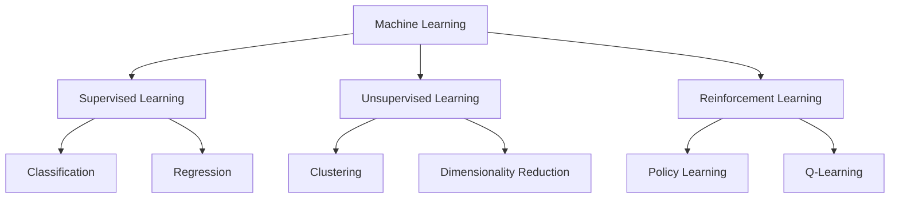
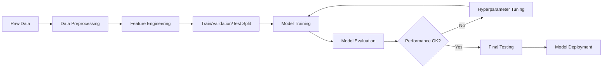

# Supervised Machine Learning

## Overview

**Supervised Machine Learning** is a type of machine learning where algorithms learn from labeled training data to make predictions or decisions on new, unseen data. The "supervision" comes from having both input features and known output labels during the training process.

> [!note] Key Insight Supervised learning is like learning with a teacher - you have examples with correct answers to guide the learning process.

## Definition & Core Concepts

Supervised learning involves training a model on a dataset containing:

- **Features (X)**: Input variables or attributes
- **Labels (y)**: Known output values or target variables

The goal is to find a mapping function `f(X) = y` that can accurately predict labels for new, unlabeled data.

### Types of Supervised Learning

|Type|Description|Output|Examples|
|---|---|---|---|
|**Classification**|Predicts discrete categories|Categorical|Email spam detection, Image recognition|
|**Regression**|Predicts continuous values|Numerical|House prices, Stock prices, Temperature|

## Comparison with Other ML Types

mermaid



### Key Differences

- **[[Supervised Learning]]**: Uses labeled data, learns input-output mapping
- **[[Unsupervised Learning]]**: No labels, finds hidden patterns in data
- **[[Reinforcement Learning]]**: Learns through rewards/penalties, agent-environment interaction

> [!tip] Memory Aid **Supervised**: Teacher provides answers **Unsupervised**: Student finds patterns alone **Reinforcement**: Student learns through trial and error

## Core Concepts & Terminology

### Dataset Components

- **Training Set**: Data used to train the model
- **Validation Set**: Data used for model selection and hyperparameter tuning
- **Test Set**: Data used for final model evaluation

### Key Challenges

#### [[Overfitting]]

> [!warning] Overfitting Model performs well on training data but poorly on new data. The model memorizes rather than generalizes.

#### [[Underfitting]]

> [!warning] Underfitting Model is too simple to capture underlying patterns. Poor performance on both training and test data.

#### [[Bias-Variance Tradeoff]]

- **High Bias**: Model is too simple (underfitting)
- **High Variance**: Model is too complex (overfitting)
- **Goal**: Find optimal balance between bias and variance

## Major Supervised Learning Algorithms

### Linear Models

#### Linear Regression

python

```python
from sklearn.linear_model import LinearRegression
from sklearn.model_selection import train_test_split
from sklearn.metrics import mean_squared_error, r2_score

# Example: Predicting house prices
X_train, X_test, y_train, y_test = train_test_split(X, y, test_size=0.2, random_state=42)

model = LinearRegression()
model.fit(X_train, y_train)
predictions = model.predict(X_test)

mse = mean_squared_error(y_test, predictions)
r2 = r2_score(y_test, predictions)
```

#### Logistic Regression

python

```python
from sklearn.linear_model import LogisticRegression
from sklearn.metrics import accuracy_score, classification_report

# Example: Email spam classification
model = LogisticRegression()
model.fit(X_train, y_train)
predictions = model.predict(X_test)

accuracy = accuracy_score(y_test, predictions)
report = classification_report(y_test, predictions)
```

### Tree-Based Methods

#### Decision Trees

python

```python
from sklearn.tree import DecisionTreeClassifier
from sklearn.tree import plot_tree
import matplotlib.pyplot as plt

model = DecisionTreeClassifier(max_depth=3, random_state=42)
model.fit(X_train, y_train)

# Visualize tree
plt.figure(figsize=(12, 8))
plot_tree(model, feature_names=feature_names, class_names=class_names, filled=True)
```

#### Random Forest

python

```python
from sklearn.ensemble import RandomForestClassifier

model = RandomForestClassifier(n_estimators=100, random_state=42)
model.fit(X_train, y_train)
predictions = model.predict(X_test)
```

### Instance-Based Learning

#### k-Nearest Neighbors (kNN)

python

```python
from sklearn.neighbors import KNeighborsClassifier

model = KNeighborsClassifier(n_neighbors=5)
model.fit(X_train, y_train)
predictions = model.predict(X_test)
```

### Support Vector Machines

python

```python
from sklearn.svm import SVC

model = SVC(kernel='rbf', C=1.0, gamma='scale')
model.fit(X_train, y_train)
predictions = model.predict(X_test)
```

### Ensemble Methods

#### Gradient Boosting

python

```python
from sklearn.ensemble import GradientBoostingClassifier

model = GradientBoostingClassifier(n_estimators=100, learning_rate=0.1, random_state=42)
model.fit(X_train, y_train)
predictions = model.predict(X_test)
```

### Neural Networks

python

```python
from sklearn.neural_network import MLPClassifier

model = MLPClassifier(hidden_layer_sizes=(100, 50), max_iter=1000, random_state=42)
model.fit(X_train, y_train)
predictions = model.predict(X_test)
```

## Machine Learning Pipeline

mermaid



### ML Pipeline Checklist

- [ ]  **Data Collection**: Gather relevant, quality data
- [ ]  **Data Preprocessing**: Handle missing values, outliers, duplicates
- [ ]  **Feature Engineering**: Create, select, and transform features
- [ ]  **Data Splitting**: Divide into train/validation/test sets
- [ ]  **Model Selection**: Choose appropriate algorithm
- [ ]  **Model Training**: Fit model to training data
- [ ]  **Model Evaluation**: Assess performance on validation set
- [ ]  **Hyperparameter Tuning**: Optimize model parameters
- [ ]  **Final Testing**: Evaluate on test set
- [ ]  **Model Deployment**: Put model into production

### Data Preprocessing Steps

python

```python
from sklearn.preprocessing import StandardScaler, LabelEncoder
from sklearn.impute import SimpleImputer
import pandas as pd

# Handle missing values
imputer = SimpleImputer(strategy='mean')
X_numeric = imputer.fit_transform(X_numeric)

# Scale features
scaler = StandardScaler()
X_scaled = scaler.fit_transform(X_numeric)

# Encode categorical variables
label_encoder = LabelEncoder()
y_encoded = label_encoder.fit_transform(y)
```

## Evaluation Metrics

### Classification Metrics

|Metric|Formula|Use Case|
|---|---|---|
|**Accuracy**|`(TP + TN) / (TP + TN + FP + FN)`|Balanced datasets|
|**Precision**|`TP / (TP + FP)`|When false positives are costly|
|**Recall**|`TP / (TP + FN)`|When false negatives are costly|
|**F1-Score**|`2 * (Precision * Recall) / (Precision + Recall)`|Balance of precision and recall|
|**ROC-AUC**|Area under ROC curve|Overall performance measure|

python

```python
from sklearn.metrics import accuracy_score, precision_score, recall_score, f1_score, roc_auc_score

# Calculate classification metrics
accuracy = accuracy_score(y_test, predictions)
precision = precision_score(y_test, predictions, average='weighted')
recall = recall_score(y_test, predictions, average='weighted')
f1 = f1_score(y_test, predictions, average='weighted')
auc = roc_auc_score(y_test, prediction_probs)
```

### Regression Metrics

|Metric|Formula|Description|
|---|---|---|
|**MSE**|`Σ(y_actual - y_pred)² / n`|Mean Squared Error|
|**RMSE**|`√MSE`|Root Mean Squared Error|
|**MAE**|`Σ|y_actual - y_pred|
|**R²**|`1 - (SS_res / SS_tot)`|Coefficient of Determination|

python

```python
from sklearn.metrics import mean_squared_error, mean_absolute_error, r2_score
import numpy as np

# Calculate regression metrics
mse = mean_squared_error(y_test, predictions)
rmse = np.sqrt(mse)
mae = mean_absolute_error(y_test, predictions)
r2 = r2_score(y_test, predictions)
```

## Real-World Examples

### Classification Examples

> **Email Spam Detection**
> 
> - **Features**: Email text, sender, subject line, attachments
> - **Labels**: Spam (1) or Not Spam (0)
> - **Algorithm**: Logistic Regression, Naive Bayes

> **Medical Diagnosis**
> 
> - **Features**: Symptoms, test results, patient history
> - **Labels**: Disease categories or healthy/sick
> - **Algorithm**: Random Forest, SVM

> **Image Recognition**
> 
> - **Features**: Pixel values, color channels
> - **Labels**: Object categories (cat, dog, car)
> - **Algorithm**: Convolutional Neural Networks

### Regression Examples

> **House Price Prediction**
> 
> - **Features**: Location, size, bedrooms, age
> - **Target**: Price in dollars
> - **Algorithm**: Linear Regression, Random Forest

> **Stock Price Forecasting**
> 
> - **Features**: Historical prices, volume, market indicators
> - **Target**: Future price
> - **Algorithm**: Time Series Models, Neural Networks

> **Weather Prediction**
> 
> - **Features**: Temperature, humidity, pressure, wind
> - **Target**: Future temperature
> - **Algorithm**: Regression Trees, Ensemble Methods

## Challenges & Best Practices

### Common Challenges

> [!warning] Data Quality Issues
> 
> - Missing values
> - Outliers and noise
> - Inconsistent data formats
> - Biased or unrepresentative samples

> [!warning] Model Selection
> 
> - Choosing appropriate algorithms
> - Balancing model complexity
> - Handling high-dimensional data
> - Cross-validation strategies

### Best Practices

> [!tip] Data Preparation
> 
> - **Clean thoroughly**: Handle missing values and outliers
> - **Feature engineering**: Create meaningful features
> - **Proper splitting**: Use stratification for imbalanced datasets
> - **Scaling**: Normalize features for distance-based algorithms

> [!tip] Model Development
> 
> - **Start simple**: Begin with baseline models
> - **Cross-validation**: Use k-fold CV for robust evaluation
> - **Hyperparameter tuning**: Use grid search or random search
> - **Ensemble methods**: Combine multiple models for better performance

> [!tip] Validation & Testing
> 
> - **Separate test set**: Keep test data completely unseen
> - **Multiple metrics**: Don't rely on single metric
> - **Statistical significance**: Test if improvements are meaningful
> - **Domain validation**: Ensure results make business sense

### Hyperparameter Tuning

python

```python
from sklearn.model_selection import GridSearchCV, RandomizedSearchCV

# Grid Search Example
param_grid = {
    'n_estimators': [50, 100, 200],
    'max_depth': [3, 5, 7, None],
    'min_samples_split': [2, 5, 10]
}

grid_search = GridSearchCV(
    RandomForestClassifier(random_state=42),
    param_grid,
    cv=5,
    scoring='accuracy',
    n_jobs=-1
)

grid_search.fit(X_train, y_train)
best_model = grid_search.best_estimator_
```

## Advanced Topics

### [[Cross-Validation]]

- K-fold cross-validation
- Stratified cross-validation
- Time series cross-validation

### [[Feature Engineering]]

- Feature selection techniques
- Dimensionality reduction ([[PCA]], [[t-SNE]])
- Feature importance and interpretation

### [[Model Interpretability]]

- SHAP values
- LIME (Local Interpretable Model-agnostic Explanations)
- Feature importance plots

### [[Ensemble Methods]]

- Bagging (Bootstrap Aggregating)
- Boosting (AdaBoost, Gradient Boosting)
- Stacking and Blending

## Related Concepts

- [[Machine Learning Fundamentals]]
- [[Data Preprocessing]]
- [[Model Evaluation]]
- [[Hyperparameter Tuning]]
- [[Feature Selection]]
- [[Ensemble Learning]]
- [[Cross-Validation]]
- [[Overfitting and Underfitting]]
- [[Bias-Variance Tradeoff]]

## Summary & Key Takeaways

> [!note] Key Takeaways
> 
> 1. **Supervised learning** uses labeled data to learn input-output mappings
> 2. **Two main types**: Classification (discrete) and Regression (continuous)
> 3. **Algorithm choice** depends on data size, interpretability needs, and problem complexity
> 4. **Proper evaluation** requires separate test sets and appropriate metrics
> 5. **Data quality** is often more important than algorithm choice
> 6. **Overfitting** is a major concern - always validate on unseen data
> 7. **Feature engineering** can be more impactful than model selection
> 8. **Ensemble methods** often provide the best performance
> 9. **Cross-validation** is essential for robust model evaluation
> 10. **Domain knowledge** should guide both feature creation and model interpretation

### Quick Reference

|Task|Best Starting Algorithms|Key Considerations|
|---|---|---|
|**Small Dataset**|Linear/Logistic Regression, kNN|Avoid complex models|
|**Large Dataset**|Random Forest, Gradient Boosting|Computational efficiency|
|**High Interpretability**|Decision Trees, Linear Models|Business requirements|
|**High Accuracy**|Ensemble Methods, Neural Networks|Performance over interpretability|
|**Imbalanced Data**|Random Forest, SVM with class weights|Appropriate metrics (F1, AUC)|

---

_Tags: #MachineLearning #SupervisedLearning #DataScience #AI_ _Created: {{date}}_ _Last Modified: {{date}}_