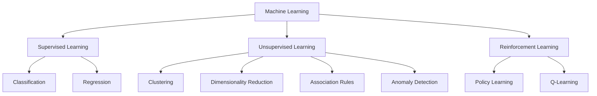
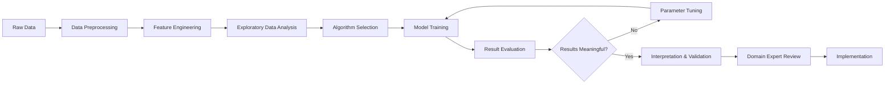

# Unsupervised Machine Learning

## Overview

**Unsupervised Machine Learning** is a type of machine learning that finds hidden patterns, structures, or relationships in data without using labeled examples. Unlike supervised learning, there are no target variables or "correct answers" to guide the learning process.

> [!note] Key Insight Unsupervised learning is like exploring a new city without a map - you discover patterns and structures on your own through observation and analysis.

## Definition & Core Concepts

Unsupervised learning involves analyzing datasets containing only:

- **Features (X)**: Input variables or attributes
- **No Labels**: No known output values or target variables

The goal is to discover hidden structures, patterns, or representations in the data that were not previously known.

### Types of Unsupervised Learning

|Type|Description|Purpose|Examples|
|---|---|---|---|
|**Clustering**|Groups similar data points|Find natural groupings|Customer segmentation, Gene sequencing|
|**Dimensionality Reduction**|Reduces feature space|Visualization, compression|Data visualization, Feature extraction|
|**Association Rules**|Finds relationships between variables|Market basket analysis|"People who buy X also buy Y"|
|**Anomaly Detection**|Identifies unusual patterns|Fraud detection, outlier identification|Credit card fraud, System monitoring|
|**Density Estimation**|Models data distribution|Probability estimation|Risk assessment, Generative modeling|

## Comparison with Other ML Types



### Key Differences

|Aspect|[[Supervised Learning]]|**Unsupervised Learning**|[[Reinforcement Learning]]|
|---|---|---|---|
|**Data**|Labeled (X, y)|Unlabeled (X only)|Environment interactions|
|**Goal**|Predict outcomes|Discover patterns|Maximize rewards|
|**Feedback**|Correct answers provided|No feedback|Reward/penalty signals|
|**Evaluation**|Clear metrics (accuracy, MSE)|Domain-dependent, subjective|Cumulative reward|

> [!tip] Memory Aid **Supervised**: Learning with a teacher **Unsupervised**: Learning through self-discovery **Reinforcement**: Learning through trial and reward

## Core Concepts & Terminology

### Fundamental Challenges

#### Pattern Discovery

- Identifying meaningful structures without guidance
- Distinguishing signal from noise
- Determining optimal number of patterns/clusters

#### [[Curse of Dimensionality]]

> [!warning] High-Dimensional Challenge As dimensions increase, data becomes sparse and distance measures become less meaningful. Many unsupervised algorithms struggle in high-dimensional spaces.

#### Evaluation Complexity

> [!warning] Subjective Evaluation Unlike supervised learning, there's often no single "correct" answer. Evaluation depends on domain knowledge and business context.

### Key Metrics & Validation

#### Internal Validation

- **Silhouette Score**: Measures cluster cohesion and separation
- **Inertia/WCSS**: Within-cluster sum of squares
- **Davies-Bouldin Index**: Ratio of within-cluster to between-cluster distances

#### External Validation (when ground truth available)

- **Adjusted Rand Index (ARI)**: Similarity to true clustering
- **Normalized Mutual Information (NMI)**: Information shared with true labels
- **Homogeneity & Completeness**: Cluster purity measures

## Major Unsupervised Learning Algorithms

### Clustering Algorithms

#### K-Means Clustering

```python
from sklearn.cluster import KMeans
from sklearn.metrics import silhouette_score
import matplotlib.pyplot as plt

# Basic K-Means implementation
kmeans = KMeans(n_clusters=3, random_state=42, n_init=10)
cluster_labels = kmeans.fit_predict(X)

# Evaluate clustering
silhouette_avg = silhouette_score(X, cluster_labels)
print(f'Silhouette Score: {silhouette_avg:.3f}')

# Find optimal number of clusters (Elbow Method)
inertias = []
K_range = range(1, 11)
for k in K_range:
    kmeans = KMeans(n_clusters=k, random_state=42, n_init=10)
    kmeans.fit(X)
    inertias.append(kmeans.inertia_)

plt.plot(K_range, inertias, 'bo-')
plt.xlabel('Number of Clusters (k)')
plt.ylabel('Inertia')
plt.title('Elbow Method for Optimal k')
```

#### Hierarchical Clustering

```python
from sklearn.cluster import AgglomerativeClustering
from scipy.cluster.hierarchy import dendrogram, linkage
import matplotlib.pyplot as plt

# Agglomerative Clustering
hierarchical = AgglomerativeClustering(n_clusters=3, linkage='ward')
cluster_labels = hierarchical.fit_predict(X)

# Create dendrogram
linkage_matrix = linkage(X, method='ward')
plt.figure(figsize=(12, 8))
dendrogram(linkage_matrix, truncate_mode='level', p=3)
plt.title('Hierarchical Clustering Dendrogram')
plt.xlabel('Sample Index')
plt.ylabel('Distance')
```

#### DBSCAN (Density-Based Clustering)

```python
from sklearn.cluster import DBSCAN
from sklearn.preprocessing import StandardScaler

# Standardize features (important for DBSCAN)
scaler = StandardScaler()
X_scaled = scaler.fit_transform(X)

# DBSCAN clustering
dbscan = DBSCAN(eps=0.5, min_samples=5)
cluster_labels = dbscan.fit_predict(X_scaled)

# Count clusters and noise points
n_clusters = len(set(cluster_labels)) - (1 if -1 in cluster_labels else 0)
n_noise = list(cluster_labels).count(-1)
print(f'Number of clusters: {n_clusters}')
print(f'Number of noise points: {n_noise}')
```

#### Gaussian Mixture Models (GMM)

```python
from sklearn.mixture import GaussianMixture
from sklearn.model_selection import GridSearchCV
import numpy as np

# GMM with different numbers of components
n_components_range = range(1, 8)
models = []
bic_scores = []
aic_scores = []

for n_components in n_components_range:
    gmm = GaussianMixture(n_components=n_components, random_state=42)
    gmm.fit(X)
    models.append(gmm)
    bic_scores.append(gmm.bic(X))
    aic_scores.append(gmm.aic(X))

# Find optimal number of components
optimal_n = n_components_range[np.argmin(bic_scores)]
best_gmm = GaussianMixture(n_components=optimal_n, random_state=42)
cluster_labels = best_gmm.fit_predict(X)
```

### Dimensionality Reduction Algorithms

#### Principal Component Analysis (PCA)

```python
from sklearn.decomposition import PCA
from sklearn.preprocessing import StandardScaler
import matplotlib.pyplot as plt
import numpy as np

# Standardize data
scaler = StandardScaler()
X_scaled = scaler.fit_transform(X)

# Apply PCA
pca = PCA()
X_pca = pca.fit_transform(X_scaled)

# Analyze explained variance
explained_variance_ratio = pca.explained_variance_ratio_
cumulative_variance = np.cumsum(explained_variance_ratio)

# Plot explained variance
plt.figure(figsize=(12, 5))

plt.subplot(1, 2, 1)
plt.bar(range(1, len(explained_variance_ratio) + 1), explained_variance_ratio)
plt.xlabel('Principal Component')
plt.ylabel('Explained Variance Ratio')
plt.title('Explained Variance by Component')

plt.subplot(1, 2, 2)
plt.plot(range(1, len(cumulative_variance) + 1), cumulative_variance, 'bo-')
plt.axhline(y=0.95, color='r', linestyle='--', label='95% Variance')
plt.xlabel('Number of Components')
plt.ylabel('Cumulative Explained Variance')
plt.title('Cumulative Explained Variance')
plt.legend()

# Reduce to 2D for visualization
pca_2d = PCA(n_components=2)
X_2d = pca_2d.fit_transform(X_scaled)
```

#### t-SNE (t-Distributed Stochastic Neighbor Embedding)

```python
from sklearn.manifold import TSNE
import matplotlib.pyplot as plt

# Apply t-SNE
tsne = TSNE(n_components=2, random_state=42, perplexity=30, n_iter=1000)
X_tsne = tsne.fit_transform(X_scaled)

# Visualize results
plt.figure(figsize=(10, 8))
plt.scatter(X_tsne[:, 0], X_tsne[:, 1], alpha=0.6)
plt.title('t-SNE Visualization')
plt.xlabel('t-SNE Component 1')
plt.ylabel('t-SNE Component 2')
```

#### UMAP (Uniform Manifold Approximation and Projection)

```python
# Note: UMAP requires separate installation: pip install umap-learn
# import umap.umap_ as umap

# # Apply UMAP
# reducer = umap.UMAP(n_neighbors=15, min_dist=0.1, random_state=42)
# X_umap = reducer.fit_transform(X_scaled)

# # Visualize results
# plt.figure(figsize=(10, 8))
# plt.scatter(X_umap[:, 0], X_umap[:, 1], alpha=0.6)
# plt.title('UMAP Visualization')
# plt.xlabel('UMAP Component 1')
# plt.ylabel('UMAP Component 2')
```

#### Independent Component Analysis (ICA)

```python
from sklearn.decomposition import FastICA
import matplotlib.pyplot as plt

# Apply ICA
ica = FastICA(n_components=2, random_state=42)
X_ica = ica.fit_transform(X_scaled)

# Visualize results
plt.figure(figsize=(10, 8))
plt.scatter(X_ica[:, 0], X_ica[:, 1], alpha=0.6)
plt.title('ICA Visualization')
plt.xlabel('Independent Component 1')
plt.ylabel('Independent Component 2')
```

### Association Rule Mining

#### Market Basket Analysis

```python
# Using mlxtend library for association rules
# pip install mlxtend

from mlxtend.frequent_patterns import apriori, association_rules
from mlxtend.preprocessing import TransactionEncoder
import pandas as pd

# Example transaction data
transactions = [
    ['bread', 'milk', 'eggs'],
    ['bread', 'butter'],
    ['milk', 'eggs', 'butter'],
    ['bread', 'milk', 'butter'],
    ['bread', 'eggs']
]

# Encode transactions
te = TransactionEncoder()
te_ary = te.fit(transactions).transform(transactions)
df = pd.DataFrame(te_ary, columns=te.columns_)

# Find frequent itemsets
frequent_itemsets = apriori(df, min_support=0.4, use_colnames=True)

# Generate association rules
rules = association_rules(frequent_itemsets, metric="confidence", min_threshold=0.6)
print(rules[['antecedents', 'consequents', 'support', 'confidence', 'lift']])
```

### Anomaly Detection

#### Isolation Forest

```python
from sklearn.ensemble import IsolationForest
import matplotlib.pyplot as plt

# Apply Isolation Forest
isolation_forest = IsolationForest(contamination=0.1, random_state=42)
anomaly_labels = isolation_forest.fit_predict(X)

# Visualize results (for 2D data)
plt.figure(figsize=(10, 8))
normal_points = X[anomaly_labels == 1]
anomalies = X[anomaly_labels == -1]

plt.scatter(normal_points[:, 0], normal_points[:, 1], c='blue', label='Normal', alpha=0.6)
plt.scatter(anomalies[:, 0], anomalies[:, 1], c='red', label='Anomaly', alpha=0.8)
plt.title('Anomaly Detection with Isolation Forest')
plt.legend()
```

#### One-Class SVM

```python
from sklearn.svm import OneClassSVM

# Apply One-Class SVM
one_class_svm = OneClassSVM(gamma='scale', nu=0.1)
anomaly_labels = one_class_svm.fit_predict(X_scaled)

# Count anomalies
n_anomalies = list(anomaly_labels).count(-1)
print(f'Number of anomalies detected: {n_anomalies}')
```

#### Local Outlier Factor (LOF)

```python
from sklearn.neighbors import LocalOutlierFactor

# Apply LOF
lof = LocalOutlierFactor(n_neighbors=20, contamination=0.1)
anomaly_labels = lof.fit_predict(X_scaled)

# Get outlier scores
outlier_scores = lof.negative_outlier_factor_
```

## Unsupervised Learning Pipeline



### Unsupervised ML Pipeline Checklist

- [ ] **Data Collection**: Gather relevant, representative data
- [ ] **Data Preprocessing**: Handle missing values, outliers, scaling
- [ ] **Exploratory Data Analysis**: Understand data distribution and characteristics
- [ ] **Feature Engineering**: Create meaningful features, handle categorical data
- [ ] **Algorithm Selection**: Choose appropriate unsupervised method
- [ ] **Parameter Tuning**: Optimize hyperparameters (k, eps, dimensions, etc.)
- [ ] **Model Training**: Apply algorithm to discover patterns
- [ ] **Result Evaluation**: Use appropriate metrics and visualization
- [ ] **Interpretation**: Make sense of discovered patterns
- [ ] **Validation**: Verify results with domain experts
- [ ] **Documentation**: Record insights and methodology

### Data Preprocessing for Unsupervised Learning

```python
from sklearn.preprocessing import StandardScaler, MinMaxScaler, RobustScaler
from sklearn.impute import SimpleImputer
import pandas as pd
import numpy as np

# Handle missing values
imputer = SimpleImputer(strategy='median')
X_imputed = imputer.fit_transform(X)

# Feature scaling (very important for unsupervised learning)
# StandardScaler: zero mean, unit variance
scaler_standard = StandardScaler()
X_standard = scaler_standard.fit_transform(X_imputed)

# MinMaxScaler: scale to [0,1] range
scaler_minmax = MinMaxScaler()
X_minmax = scaler_minmax.fit_transform(X_imputed)

# RobustScaler: robust to outliers
scaler_robust = RobustScaler()
X_robust = scaler_robust.fit_transform(X_imputed)

# Handle categorical variables
df_encoded = pd.get_dummies(df, columns=['categorical_column'])
```

## Evaluation Methods & Metrics

### Clustering Evaluation

#### Internal Metrics (No Ground Truth)

```python
from sklearn.metrics import silhouette_score, calinski_harabasz_score, davies_bouldin_score

# Silhouette Score (higher is better, range: -1 to 1)
silhouette_avg = silhouette_score(X, cluster_labels)

# Calinski-Harabasz Index (higher is better)
ch_score = calinski_harabasz_score(X, cluster_labels)

# Davies-Bouldin Index (lower is better)
db_score = davies_bouldin_score(X, cluster_labels)

print(f'Silhouette Score: {silhouette_avg:.3f}')
print(f'Calinski-Harabasz Score: {ch_score:.3f}')
print(f'Davies-Bouldin Score: {db_score:.3f}')
```

#### External Metrics (Ground Truth Available)

```python
from sklearn.metrics import adjusted_rand_score, normalized_mutual_info_score, homogeneity_completeness_v_measure

# Adjusted Rand Index
ari = adjusted_rand_score(true_labels, cluster_labels)

# Normalized Mutual Information
nmi = normalized_mutual_info_score(true_labels, cluster_labels)

# Homogeneity, Completeness, V-measure
homogeneity, completeness, v_measure = homogeneity_completeness_v_measure(true_labels, cluster_labels)

print(f'Adjusted Rand Index: {ari:.3f}')
print(f'Normalized Mutual Information: {nmi:.3f}')
print(f'V-measure: {v_measure:.3f}')
```

### Dimensionality Reduction Evaluation

#### Explained Variance (PCA)

```python
# Calculate cumulative explained variance
cumulative_variance = np.cumsum(pca.explained_variance_ratio_)

# Find number of components for 95% variance
n_components_95 = np.argmax(cumulative_variance >= 0.95) + 1
print(f'Components needed for 95% variance: {n_components_95}')
```

#### Reconstruction Error

```python
# For PCA
X_reconstructed = pca.inverse_transform(X_pca)
reconstruction_error = np.mean((X_scaled - X_reconstructed) ** 2)
print(f'PCA Reconstruction Error: {reconstruction_error:.4f}')
```

### Anomaly Detection Evaluation

```python
from sklearn.metrics import classification_report, roc_auc_score

# When ground truth is available
if 'true_anomaly_labels' in locals():
    # Convert anomaly labels (-1/1) to (1/0)
    predicted_binary = (anomaly_labels == -1).astype(int)
    true_binary = (true_anomaly_labels == -1).astype(int)
    
    print(classification_report(true_binary, predicted_binary))
    auc_score = roc_auc_score(true_binary, predicted_binary)
    print(f'AUC Score: {auc_score:.3f}')
```

## Real-World Applications & Examples

### Clustering Applications

> **Customer Segmentation**
> 
> - **Data**: Purchase history, demographics, behavior
> - **Goal**: Group customers for targeted marketing
> - **Algorithm**: K-Means, GMM
> - **Business Impact**: Personalized campaigns, improved retention

> **Gene Sequencing**
> 
> - **Data**: DNA sequences, expression levels
> - **Goal**: Identify gene families or disease patterns
> - **Algorithm**: Hierarchical Clustering, DBSCAN
> - **Scientific Impact**: Disease understanding, drug development

> **Social Network Analysis**
> 
> - **Data**: User interactions, connections, content
> - **Goal**: Identify communities or influential users
> - **Algorithm**: Community Detection, Graph Clustering
> - **Applications**: Content recommendation, viral marketing

### Dimensionality Reduction Applications

> **Data Visualization**
> 
> - **Data**: High-dimensional datasets
> - **Goal**: Create 2D/3D visualizations for human understanding
> - **Algorithm**: t-SNE, UMAP, PCA
> - **Use Cases**: Exploratory analysis, presentation of results

> **Feature Extraction**
> 
> - **Data**: Images, text, sensor data
> - **Goal**: Reduce dimensions while preserving information
> - **Algorithm**: PCA, ICA, Autoencoders
> - **Applications**: Preprocessing for [[Supervised Learning]], compression

> **Noise Reduction**
> 
> - **Data**: Noisy measurements, signals
> - **Goal**: Extract clean signal from noise
> - **Algorithm**: PCA, Factor Analysis
> - **Applications**: Signal processing, image denoising

### Association Rule Applications

> **Market Basket Analysis**
> 
> - **Data**: Transaction records, purchase history
> - **Goal**: Find products frequently bought together
> - **Metrics**: Support, Confidence, Lift
> - **Business Impact**: Product placement, cross-selling strategies

> **Web Usage Mining**
> 
> - **Data**: Click streams, page visits
> - **Goal**: Understand user navigation patterns
> - **Applications**: Website optimization, content recommendations

### Anomaly Detection Applications

> **Fraud Detection**
> 
> - **Data**: Transaction patterns, user behavior
> - **Goal**: Identify suspicious activities
> - **Algorithm**: Isolation Forest, One-Class SVM
> - **Business Impact**: Reduced losses, improved security

> **System Monitoring**
> 
> - **Data**: Server logs, performance metrics
> - **Goal**: Detect system failures or attacks
> - **Algorithm**: Statistical methods, ML-based detection
> - **Applications**: IT operations, cybersecurity

> **Quality Control**
> 
> - **Data**: Manufacturing measurements, sensor data
> - **Goal**: Identify defective products
> - **Algorithm**: Control charts, statistical process control
> - **Business Impact**: Improved quality, reduced waste

## Challenges & Best Practices

### Common Challenges

> [!warning] Scalability Issues
> 
> - High computational complexity for large datasets
> - Memory requirements for distance-based methods
> - Curse of dimensionality in high-dimensional spaces

> [!warning] Parameter Selection
> 
> - Choosing optimal number of clusters (k)
> - Setting distance thresholds (eps in DBSCAN)
> - Balancing exploration vs. exploitation

> [!warning] Interpretation Difficulty
> 
> - Results can be subjective and context-dependent
> - Multiple valid solutions may exist
> - Requires domain expertise for validation

### Best Practices

> [!tip] Data Preparation
> 
> - **Scale features**: Critical for distance-based algorithms
> - **Handle outliers**: Can significantly impact results
> - **Feature selection**: Remove irrelevant or redundant features
> - **Data quality**: Clean and consistent data is essential

> [!tip] Algorithm Selection
> 
> - **Understand assumptions**: Each algorithm has different assumptions
> - **Consider data characteristics**: Size, dimensionality, noise level
> - **Multiple approaches**: Try several algorithms and compare results
> - **Domain knowledge**: Incorporate expert insights

> [!tip] Validation & Interpretation
> 
> - **Multiple metrics**: Use various evaluation measures
> - **Visualization**: Plot results for intuitive understanding
> - **Stability analysis**: Check if results are consistent across runs
> - **Business validation**: Ensure results make practical sense

### Hyperparameter Tuning Strategies

#### Elbow Method for K-Means

```python
def elbow_method(X, max_k=10):
    inertias = []
    K_range = range(1, max_k + 1)
    
    for k in K_range:
        kmeans = KMeans(n_clusters=k, random_state=42, n_init=10)
        kmeans.fit(X)
        inertias.append(kmeans.inertia_)
    
    # Plot results
    plt.figure(figsize=(10, 6))
    plt.plot(K_range, inertias, 'bo-')
    plt.xlabel('Number of Clusters (k)')
    plt.ylabel('Inertia')
    plt.title('Elbow Method for Optimal k')
    plt.grid(True)
    plt.show()
    
    return inertias
```

#### Silhouette Analysis

```python
def silhouette_analysis(X, max_k=10):
    silhouette_scores = []
    K_range = range(2, max_k + 1)
    
    for k in K_range:
        kmeans = KMeans(n_clusters=k, random_state=42, n_init=10)
        cluster_labels = kmeans.fit_predict(X)
        silhouette_avg = silhouette_score(X, cluster_labels)
        silhouette_scores.append(silhouette_avg)
    
    # Plot results
    plt.figure(figsize=(10, 6))
    plt.plot(K_range, silhouette_scores, 'ro-')
    plt.xlabel('Number of Clusters (k)')
    plt.ylabel('Average Silhouette Score')
    plt.title('Silhouette Analysis for Optimal k')
    plt.grid(True)
    plt.show()
    
    return silhouette_scores
```

## Advanced Topics

### [[Deep Learning]] for Unsupervised Learning

- Autoencoders for dimensionality reduction
- Generative Adversarial Networks (GANs)
- Variational Autoencoders (VAEs)
- Self-organizing maps

### [[Graph-Based Methods]]

- Spectral clustering
- Community detection
- Graph neural networks
- Network analysis

### [[Ensemble Methods]] for Unsupervised Learning

- Consensus clustering
- Ensemble anomaly detection
- Multiple dimensionality reduction techniques

### [[Online/Streaming]] Unsupervised Learning

- Mini-batch K-means
- Incremental PCA
- Online anomaly detection
- Concept drift detection

## Algorithm Comparison

### Clustering Algorithms Comparison

|Algorithm|Pros|Cons|Best For|
|---|---|---|---|
|**K-Means**|Fast, simple, scales well|Needs k, assumes spherical clusters|Well-separated, spherical clusters|
|**Hierarchical**|No need for k, dendrograms|Slow O(n³), sensitive to outliers|Small datasets, hierarchical structure|
|**DBSCAN**|Finds arbitrary shapes, handles noise|Sensitive to parameters, struggles with varying densities|Irregular shapes, noise handling|
|**GMM**|Probabilistic, soft assignments|Assumes Gaussian, needs k|Overlapping clusters, probability estimates|

### Dimensionality Reduction Comparison

|Algorithm|Pros|Cons|Best For|
|---|---|---|---|
|**PCA**|Linear, interpretable, fast|Only linear relationships|Linear data, feature extraction|
|**t-SNE**|Great for visualization, non-linear|Slow, not deterministic|2D/3D visualization, exploration|
|**UMAP**|Faster than t-SNE, preserves structure|Complex parameters|Large datasets, structure preservation|
|**ICA**|Finds independent sources|Assumes independence|Signal separation, blind source separation|

## Related Concepts

- [[Machine Learning Fundamentals]]
- [[Supervised Learning]]
- [[Dimensionality Reduction]]
- [[Clustering Algorithms]]
- [[Anomaly Detection]]
- [[Association Rule Mining]]
- [[Feature Engineering]]
- [[Data Visualization]]
- [[Principal Component Analysis]]
- [[Evaluation Metrics]]

## Summary & Key Takeaways

> [!note] Key Takeaways
> 
> 1. **Unsupervised learning** discovers hidden patterns without labeled data
> 2. **Four main types**: Clustering, dimensionality reduction, association rules, anomaly detection
> 3. **Feature scaling** is critical for most unsupervised algorithms
> 4. **Evaluation** is more challenging and often requires domain expertise
> 5. **Multiple algorithms** should be tried and compared
> 6. **Visualization** is essential for understanding and validating results
> 7. **Parameter tuning** often requires systematic approaches (elbow method, silhouette analysis)
> 8. **Domain knowledge** is crucial for meaningful interpretation
> 9. **Preprocessing** has major impact on results
> 10. **Results validation** should involve both statistical measures and business logic

### Quick Algorithm Selection Guide

|Scenario|Recommended Algorithm|Key Considerations|
|---|---|---|
|**Customer segmentation**|K-Means, GMM|Business interpretability|
|**Data visualization**|t-SNE, UMAP|2D/3D representation|
|**Fraud detection**|Isolation Forest, One-Class SVM|Rare event detection|
|**Market basket analysis**|Apriori, FP-Growth|Transaction patterns|
|**Exploratory analysis**|PCA + Clustering|Understanding data structure|
|**High-dimensional data**|PCA → Clustering|Dimensionality curse|
|**Irregular cluster shapes**|DBSCAN, Spectral Clustering|Non-spherical patterns|
|**Large datasets**|Mini-batch K-Means, UMAP|Computational efficiency|

### Common Pitfalls to Avoid

> [!warning] Watch Out For
> 
> - **Not scaling features** before applying distance-based algorithms
> - **Choosing k arbitrarily** without proper validation
> - **Over-interpreting results** without domain validation
> - **Ignoring outliers** that can skew entire analysis
> - **Using wrong evaluation metrics** for the specific use case

---

_Tags: #MachineLearning #UnsupervisedLearning #DataScience #AI #Clustering #DimensionalityReduction_ _Created: {{date}}_ _Last Modified: {{date}}_
